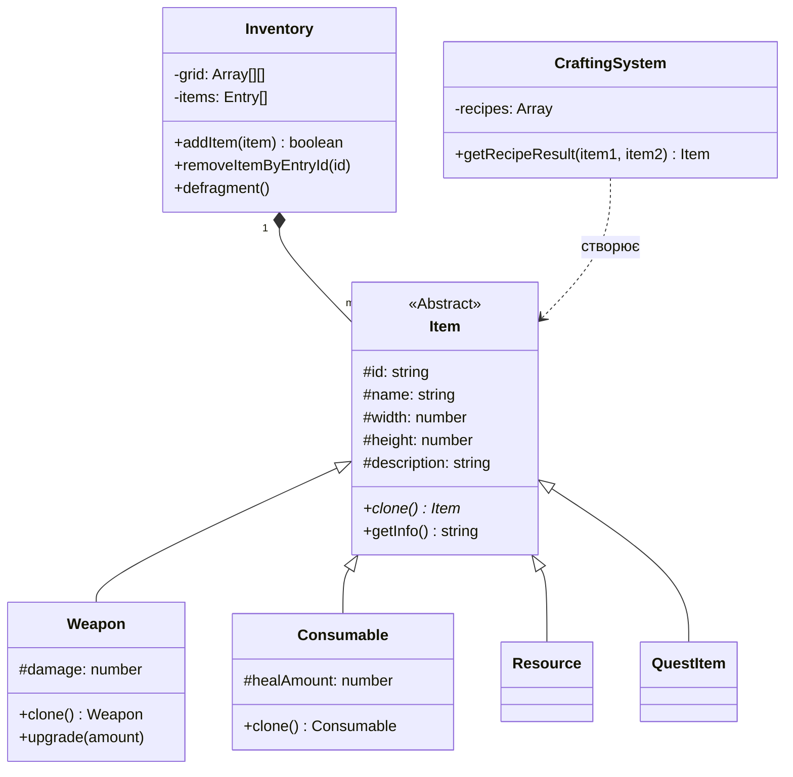

# Доменна модель: Survival-Horror Inventory System (Resident Evil Style)

## 1. Аналіз ігрових механік

Система інвентаря в іграх жанру survival-horror — це стратегічна мета-гра, заснована на менеджменті обмеженого простору та ресурсів.

### 1.1. Просторові обмеження
- **Grid System (Сітка)**: Використовується 2D-сітка розміром 8x10 клітинок.
- **Геометрія предметів**: Предмети мають фіксовані розміри (наприклад, 1x1 для трави, 1x2 для ножа, 2x2 для дробовика).
- **Фрагментація**: При видаленні предметів утворюються порожні "дірки", які можуть заважати розміщенню великих предметів навіть за наявності загального вільного місця.

### 1.2. Класифікація предметів
- **Weapon (Зброя)**: Впливає на бойову ефективність, має параметри шкоди та можливість покращення.
- **Consumable (Розхідники)**: Відновлюють здоров'я (HP).
- **Resource (Ресурси)**: Інгредієнти для створення нових предметів.
- **QuestItem (Ключові предмети)**: Необхідні для просування сюжетом.

---

## 2. Система крафту та апгрейдів

### 2.1. Рецепти (Recipes)
Рецепт визначає набір необхідних ресурсів та результат їх поєднання. Наприклад:
- Зелена трава + Зелена трава = Покращена лікувальна суміш.
- Пістолет + Набір апгрейду = Пістолет Mk.II з підвищеною шкодою.

### 2.2. Алгоритмічне рішення
Якщо предмет не поміщається в інвентар при додаванні (в тому числі після крафту), система виконує **дефрагментацію** — автоматичне ущільнення всіх наявних предметів для звільнення цілісного блоку пам'яті (клітинок).

---

## 3. UML-діаграма класів (Mermaid)

---

## 4. Обґрунтування SOLID-принципів

1.  **Single Responsibility Principle (SRP)**:
    - `Inventory.js`: Тільки математика сітки.
    - `InventoryUI.js`: Тільки відображення.
    - `CraftingSystem.js`: Тільки рецепти та логіка комбінування.
2.  **Open/Closed Principle (OCP)**: Додавання нових предметів відбувається через створення нових класів без зміни ядра інвентаря. Нові рецепти додаються як конфігураційні об'єкти.
3.  **Liskov Substitution Principle (LSP)**: Всі типи предметів успадковують `Item` та реалізують метод `clone()`, що дозволяє системі працювати з ними одноманітно.
4.  **Interface Segregation Principle (ISP)**: Специфічна поведінка (наприклад, `upgrade`) винесена в окремі класи-спадкоємці.
5.  **Dependency Inversion Principle (DIP)**: UI залежить від інтерфейсу класу `Inventory`, а не від його внутрішньої реалізації матриці.
