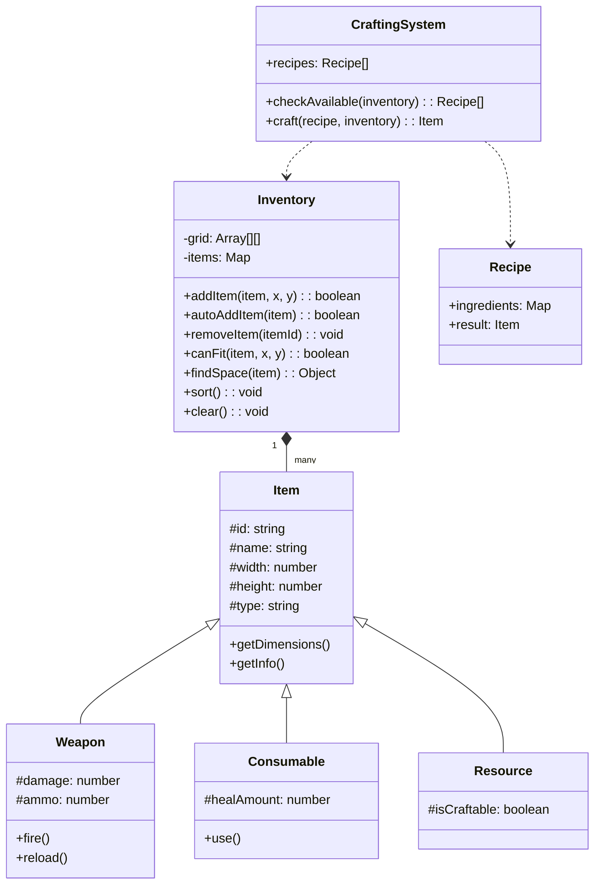

# Domain Model: Survival-Horror Inventory System

## 1. Analysis of Mechanics
The system is inspired by classic survival-horror games (Resident Evil). Key features:
- **Spatial Management**: Items have specific dimensions (e.g., 1x1, 1x2, 2x2) and must fit into a fixed 2D grid (8x10).
- **Categorization**: Items are divided into Weapons, Consumables, and Resources, each with unique properties.
- **Crafting**: Players can combine resources to create more useful items (e.g., combining herbs or ammo components).
- **Optimization**: A "Sort" function automatically rearranges items to maximize free space (defragmentation).

## 2. Entities
- **Item**: Abstract base class defining common properties (id, name, width, height).
- **Weapon**: Extends Item; includes combat stats (damage, ammo).
- **Consumable**: Extends Item; includes recovery stats (healing amount).
- **Resource**: Extends Item; used primarily for crafting.
- **Inventory**: Core logic class managing the 2D matrix, item placement, and spatial validation.
- **Recipe**: Defines required ingredients and the resulting item.
- **CraftingSystem**: Manages the list of recipes and executes the crafting logic.

## 3. Class Diagram (Mermaid.js)

## 4. SOLID Principles Justification
- **Single Responsibility Principle (SRP)**: Logic is strictly separated. `Inventory` only cares about the grid, `Item` only cares about its data, and `InventoryUI` (implementation detail) only cares about rendering.
- **Open/Closed Principle (OCP)**: Adding a new item type (e.g., `Armor` or `KeyItem`) doesn't require modifying the `Inventory` or `CraftingSystem` classes.
- **Liskov Substitution Principle (LSP)**: All item types inherit from `Item` and can be treated polymorphically by the `Inventory` system.
- **Interface Segregation Principle (ISP)**: By using specialized classes for different item behaviors, we ensure that a `Resource` doesn't need to implement `fire()` like a `Weapon`.
- **Dependency Inversion Principle (DIP)**: High-level modules (UI) interact with the `Inventory` abstraction, not with low-level grid implementation details.
